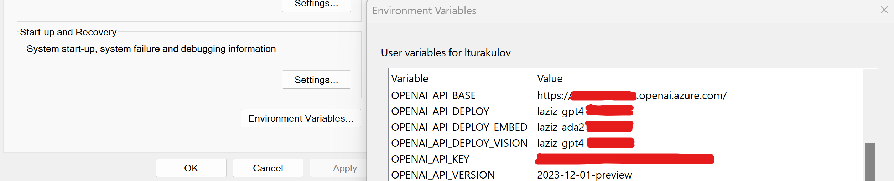
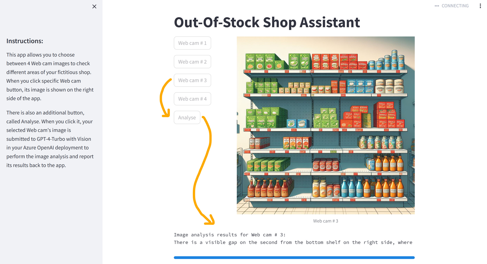

# GPT-4 Turbo with Vision: Out-of-Stock Detection (Demo Solution)
GPT-4 Turbo with Vision is a multimodal Generative AI model, available for deployment in the Azure OpenAI service. It can process images and text as prompts, and generate relevant textual responses to questions about them.

In this repo, you will find the source code of a Streamlit Web app that analyses shelf images of a fictitious retail shop to detect potential out-of-stock situations. The Web app can run locally on your computer and requires access to your Azure OpenAI endpoint to interact with the GPT-4 Turbo with Vision model.

To build this demo, I used the latest OpenAI Python SDK v1.x. To upgrade your _openai_ Python package, please use the following pip command:
```
pip install --upgrade openai
```

## Table of contents:
- [Part 1: Configuring solution environment](https://github.com/LazaUK/AOAI-GPT4Vision-Streamlit-SDKv1/tree/main?tab=readme-ov-file#part-1-configuring-solution-environment)
- [Part 2: Web app - User Guide](https://github.com/LazaUK/AOAI-GPT4Vision-Streamlit-SDKv1/tree/main?tab=readme-ov-file#part-2-web-app---user-guide)
- [Part 3: Web app - Developer Guide](https://github.com/LazaUK/AOAI-GPT4Vision-Streamlit-SDKv1/tree/main?tab=readme-ov-file#part-3-web-app---developer-guide)
- [Part 4: Web app - SysAdmin Guide](https://github.com/LazaUK/AOAI-GPT4Vision-Streamlit-SDKv1/tree/main?tab=readme-ov-file#part-4-web-app---sysadmin-guide)
- [Part 5: 1-min demo on YouTube](https://github.com/LazaUK/AOAI-GPT4Vision-Streamlit-SDKv1/tree/main?tab=readme-ov-file#part-5-1-min-demo-on-youtube)

## Part 1: Configuring solution environment
1. To use API key authentication, assign the API endpoint name, version and key, along with the Azure OpenAI deployment name of GPT-4 Turbo with Vision to **OPENAI_API_BASE**, **OPENAI_API_VERSION**, **OPENAI_API_KEY** and **OPENAI_API_DEPLOY_VISION** environment variables respectively.

>**Note**: If you want to use the Entra ID (former Azure Active Directory) authentication instead, you may find some implementation options [here](https://github.com/LazaUK/AOAI-EntraIDAuth-SDKv1).
2. Install the required Python packages, by using the **pip** command and the provided requirements.txt file.
```
pip install -r requirements.txt
```

## Part 2: Web app - User Guide
1. To launch the Web app, you should run the following command from this repo's root folder
```
streamlit run GPT4V_Streamlit.py
```
2. If everything was installed correctly as per the Part 1's instructions above, you should be able to access the demo solution's Web page at http://localhost:8501 locally.

3. The UI is very minimalistic. You need to click one of the Web cam buttons, first, to display a simulated shelf image of a fictitious retail shop.
4. Then you can click the Analyse button to submit the selected image to your GPT-4 Turbo with Vision model in Azure OpenAI. If there are no significant gaps, the model should reply with a simple "Ok". If the model detects a potential out-of-stock situation because of a wider gap, it should reply with a more verbose answer, describing the location and specifics of its findings.
>**Note**: As a Generative AI solution, GPT-4 Turbo with Vision is not deterministic. So, you may get slightly different descriptions of the same image if it's analysed several times, which is expected.

## Part 3: Web app - Developer Guide
1. This Web app is based on Streamlit, an open source Python framework, and doesn't require an explicit setup of a Web service or programming in any other languages but Python.
2. The **image_paths** dictionary contains button names for simulated Web cams and associated JPEG images of the shop shelves. If you want to use your own images, just update the relevant references.
``` Python
image_paths = {
    "Web cam # 1": "images/GPT4V_OutOfStock_Image1.jpg",
    "Web cam # 2": "images/GPT4V_OutOfStock_Image2.jpg",
    "Web cam # 3": "images/GPT4V_OutOfStock_Image3.jpg",
    "Web cam # 4": "images/GPT4V_OutOfStock_Image4.jpg"
}
```
3. Connection with the backend Azure OpenAI service is established through the _openai_ Python SDK v1. Current implementation passes the Azure OpenAI endpoint's API key as a parameter value of the AzureOpenAI class. If necessary, you can switch to the Entra ID authentication instead.
``` Python
client = AzureOpenAI(
    azure_endpoint = AOAI_API_BASE,
    api_key = AOAI_API_KEY,
    api_version = AOAI_API_VERSION
)
```
4.  As the test images are hosted locally, they are converted into Base64 strings - one of the supported GPT-4 Turbo with Vision's input formats. 
``` Python
with open(image_path, "rb") as image_file:
    base64_image = base64.b64encode(image_file.read()).decode("utf-8")
```
5.  Base64 string is then passed as a part of the user prompt. Alternatively, you can enter URLs of remotely hosted images.
``` Python
{ 
    "type": "image_url",
    "image_url": {
        "url": f"data:image/jpeg;base64,{base64_image}"
    }
}
```
6.  As an "easter egg", the Web app will animate snow flakes on the first run or after a Web browser session's refresh. Post-festive season, you can comment out line # 35.
``` Python
st.snow() # New Year's theme :)
```

## Part 4: Web app - SysAdmin Guide
This repo comes with a companion Docker image on GitHub Container Registry (GHCR), which has a pre-built Web app with all the required dependencies. It allows you to launch the demo solution as a container without getting deep into its code's specifics.

There are 2 potential options to re-use the provided Docker image.

### a) Using the Docker image "as is":
1. First you can download the image from GHCR and verify that it's accessible.
```
docker pull ghcr.io/lazauk/gpt4v-outofstock:latest
```
2. Then you can launch it on your local machine and pass the values of 4 expected environment variables, described in Part 1 above. If you have values of those variables already setup on your host machine, their values will be automatically passed with the Docker run command below.
```
docker run -p 8501:8501 --env OPENAI_API_BASE --env OPENAI_API_DEPLOY_VISION --env OPENAI_API_KEY --env OPENAI_API_VERSION ghcr.io/lazauk/gpt4v-outofstock:latest
```

### b) Using the Docker image as a base for your custom one:
1. You can refer to the companion Docker image in your Dockerfile.
```
FROM ghcr.io/lazauk/gpt4v-outofstock:latest
```
2. The **GPT4V_Streamlit.py** file is located in **/app** working directory, while the images are in **/app/images**, where you can update / replace them to customise the solution.

## Part 5: 1-min demo on YouTube
This is a short, [1-min demo](https://youtu.be/uj73hyI79lg) of this solution in action.
